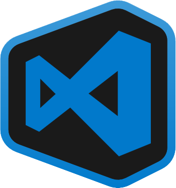

    Language:&nbsp;&nbsp;
    

<h1 align="center">
     
      
    VSCode Projects - Electron
      
</h1>

    This application was created to facilitate the listing and opening of projects on VS Code using Electron and React.

    

## Features

- **Electron** — desktop apps with JavaScript, HTML, and CSS
- **Express** — html server with javascript
- **React** — design using typescript and less

 

## Dependencies

- [Node.js](https://nodejs.org/en/) = 12.0.0

 

## Getting started

1. Clone this repository;
2. `cd vscode-projects-electron`; 
3. Run `npm run modules:init` to install dependencies. 
4. Run `npm run app:build` to create build design. 
4. Run `npm start`.

 

## Build

- **Windows:** To compile for Windows just run the command `npm run build-win` or` npm run build-win: dev` (for developer mode)
- **Linux:** _Not implemented_
- **MacOS:** _Not implemented_

 

## Contributing

Please read [Contributing.md](Contributing.md) for details on the code of conduct, and the process for submitting pull requests.

 

## License

This project is licensed under the MIT License - see the [License.md](License.md) file for details.

 

## Others

This application is based on challenge developed by <a href="https://github.com/rocketseat">Rocketseat</a>, to find out more about how the idea came about, go to see the original repository <a href="https://github.com/rocketseat-content/youtube-challenge-electron-tray">here</a>.